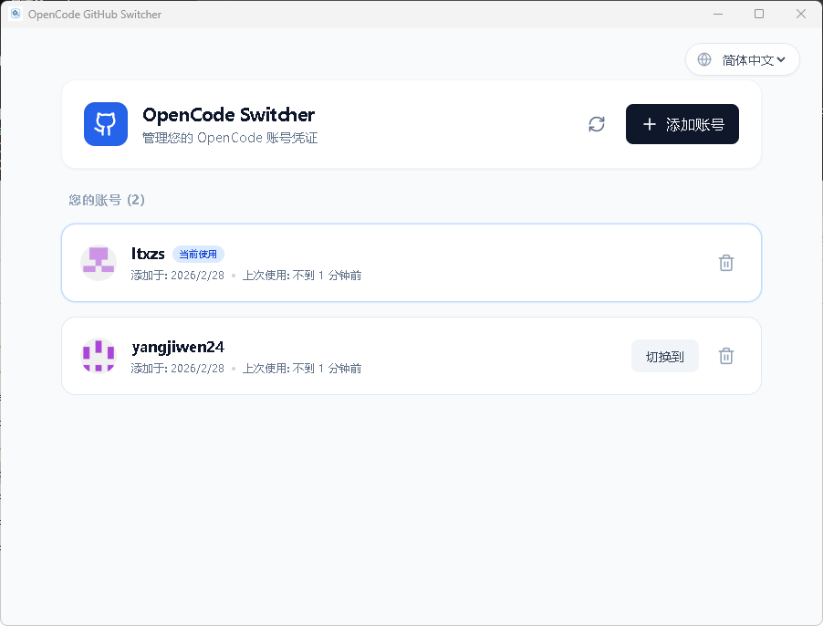
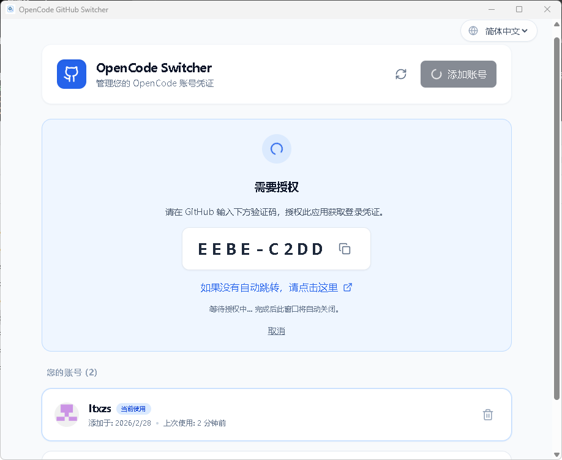
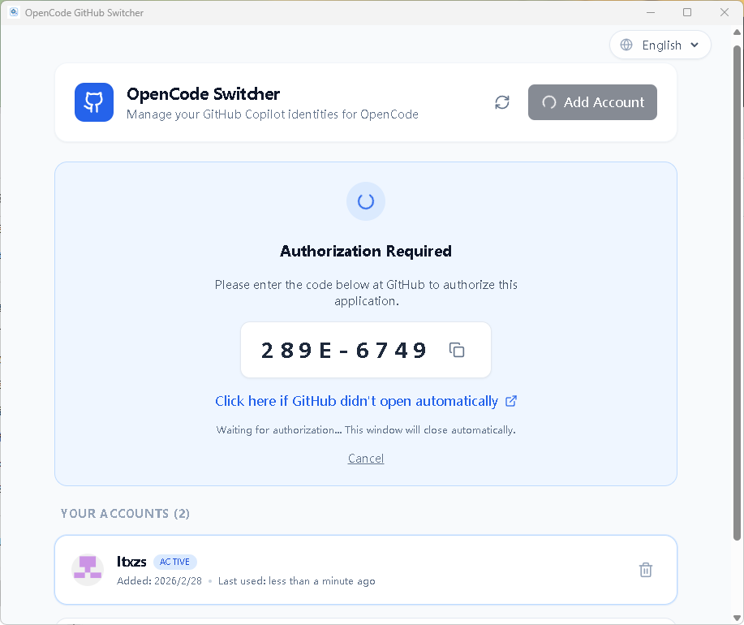

# OpenCode GitHub Copilot Switcher

[English](./README.md) | [简体中文](./README_zh.md) | [日本語](./README_ja.md)

一款基于 Tauri 构建的跨平台桌面端工具，旨在为 OpenCode 用户提供便捷的 GitHub Copilot 账号管理、切换与设备授权流登录功能。

## 功能特性

- **多账号管理：** 轻松添加并在多个 GitHub 账号之间切换。
- **无缝热切换：** 支持在当前会话中直接进行热切换账号，**无需重启 OpenCode** 即可生效。
- **原生设备授权登录：** 深度集成提取自官方的 OpenCode GitHub Copilot Client ID，确保与官方扩展完全兼容。
- **自动复制设备码：** 在进行 GitHub 授权时，自动将验证码复制到剪贴板，并弹出 Toast 提示用户，简化操作流程。
- **跨平台支持：** 提供 Windows、macOS 和 Linux 三个平台的安装包。

## 可视化操作体验





本工具提供了清晰直观的可视化界面，这也是其核心的操作优势。你可以非常具体形象地管理你的 GitHub Copilot 账号：一目了然地查看当前活跃账号、便捷地添加新账号，以及通过一键点击实现无缝热切换，彻底摆脱原生环境中重复且繁琐的命令或盲目的登录流程。

## 为什么需要这个工具？

**解决原生切换繁琐的问题：** OpenCode 原生切换 GitHub Copilot 账号的步骤非常复杂且不够直观。而本项目提供了一个清晰的界面，让你不仅能方便地管理账号，还能实现**热切换**（无缝切换账号而无需重启 OpenCode 客户端），极大地提升了使用体验。

**突破优惠账号额度限制的频繁切换：** 本工具的设计初衷是为了解决在 OpenCode 中登录 GitHub Copilot 首月免费或教育认证等优惠账号时，因受限于账号的额度而无法进行重度使用，从而需要频繁切换账号的问题。OpenCode 原生的切换方式重复且繁琐，本工具通过热切换机制极大地简化了这一流程。

## 安装指南

请前往项目的 [Releases](https://github.com/ltxzs/opencode-github-copilot-switcher/releases) 页面，下载适合您操作系统的最新版本。

- **Windows:** 下载 `.exe` 或 `.msi` 
- **macOS:** 下载 `.app` 或 `.dmg`
- **Linux:** 下载 `.AppImage` 或 `.deb`

## 本地开发开发

本项目使用了以下主要技术栈：
- **Tauri** (Rust)
- **React** (Vite)
- **Tailwind CSS**

### 环境要求

- [Node.js](https://nodejs.org/)
- [Rust](https://rustup.rs/)

### 启动步骤

1. 克隆本仓库：
   ```bash
   git clone https://github.com/ltxzs/opencode-github-copilot-switcher.git
   cd opencode-github-copilot-switcher/opencode-github-switcher
   ```

2. 安装依赖：
   ```bash
   npm install
   ```

3. 启动开发环境：
   ```bash
   npm run tauri dev
   ```

4. 构建生产版本：
   ```bash
   npm run tauri build
   ```

## 许可证

本项目采用 MIT 许可证。详情请参阅 [LICENSE](LICENSE) 文件。